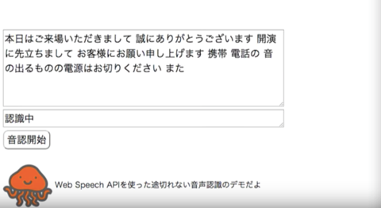

# Speech recognition without interruptions by Web Speech API

Web Speech APIを使った途切れない音声認識です！

Video：https://youtu.be/cAs0tY1aGBM

この「途切れない」というのが今回のミソです。Web Speech APIはJavaScriptで非常に簡単にプログラミングできますが、数秒経つと音声認識が停止してしまいます。そうなると手動で再開しなければいけなかったり、再開の度にマイクの使用許可を聞かれて毎回タップするのが面倒です。
そんな面倒な手間を解放し、途切れずに長時間、音声認識を続ける技を紹介します！

詳細解説はこちら
http://jellyware.jp/kurage/iot/webspeechapi.html
